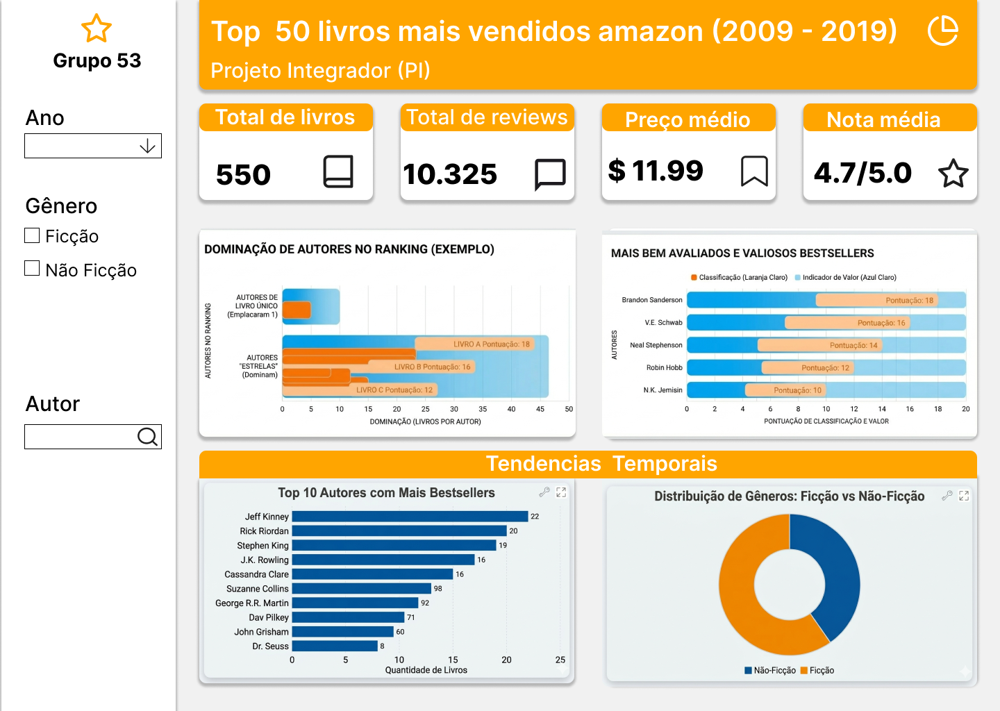

# Projeto Integrador: Análise de Tendências dos Bestsellers Amazon (2009-2019)

## 1. Tema do Projeto
Análise descritiva e identificação de tendências de mercado a partir do dataset de livros mais vendidos da Amazon (Top 50 anuais) no período de 2009 a 2019.

## 2. Integrantes
* MICHAEL DE SOUZA TEIXEIRA
* KAUAN RIBEIRO TERUEL
* FILIPE PINHEIRO
* GIUSLENE GONCALVES DA SILVA
* MAR DO NASCIMENTO MORAES
* VITOR HENRIQUE RIBAS
* ISAQUE ROCHA VENANCIO
* JOAO PEDRO DE ALMEIDA ABREU

## 3. Objetivo da Análise
O objetivo central deste projeto é realizar uma **análise descritiva** para compreender como o comportamento de consumo literário evoluiu ao longo do tempo. Buscamos identificar padrões e tendências, respondendo a perguntas como:

* **Preferência de Gênero:** Houve uma mudança na predominância entre Ficção e Não-Ficção ao longo dos anos?
* **Comportamento de Preços:** Qual a tendência dos preços médios dos bestsellers? Livros de ficção tendem a ser mais caros?
* **Engajamento do Público:** Como o volume de avaliações (*Reviews*) cresceu ao longo do período?
* **Fidelidade e Popularidade:** Quais autores conseguiram manter tendências de vendas consistentes por múltiplos anos?

## 4. Planejamento das Tarefas

* **Design(Figma):** Criação de design de tela, para facilitar o desenvolvimento e tornar mais visivel o projeto

* **Extração e Tratamento (Pandas):** Carregamento do arquivo `.csv`, limpeza de dados para evitar distorções nas métricas de tendência.
* **Armazenamento (SQLite):** Exportação da base de dados limpa e transformada para um banco de dados **SQLite**, garantindo a organização dos dados e permitindo consultas SQL estruturadas.
* **Análise Descritiva:** Utilização de técnicas estatísticas (média, mediana, desvio padrão) para descrever o perfil dos dados ano a ano.
* **Visualização:** Desenvolvimento de um dashboard interativo utilizando **Streamlit**.

## 5. Cronograma Inicial
* **Etapa 1 (Finalizado):** Entrega do planejamento e estruturação do repositório no GitHub.
* **Etapa 2 (Em andamento):** Desenvolvimento do pipeline de dados (Pandas -> SQLite) e criação das visualizações de tendência no Streamlit.

## 6. Metodologia e Ferramentas
* **Figma:** Design profissional de telas
* **Python & Pandas:** Manipulação principal e cálculos estatísticos.
* **SQLite:** Persistência dos dados para consultas eficientes e integridade da informação.
* **Streamlit:** Interface de exibição dos insights e gráficos de tendência.

## 7. Estrutura do Dataset
O dataset original contém as seguintes colunas:
* `Name`: Título do livro.
* `Author`: Autor da obra.
* `User Rating`: Avaliação média dos usuários (0-5).
* `Reviews`: Número de avaliações recebidas.
* `Price`: Preço de venda na plataforma.
* `Year`: Ano em que o livro figurou no ranking.
* `Genre`: Categoria (Fiction / Non Fiction).

## 8. Ideia Inicial do Dashboard
O dashboard focará na visualização de tendências. Abaixo está o protótipo da primeira interface planejada (Sujeito a mudaças):

O dashboard focará na visualização de tendências através de:
1. **Painel Temporal:** Gráficos de barras mostrando os livros mais bem avaliados, top autores do periodo e evolução do preço médio e do volume de reviews por ano.
2. **Comparativo de Gêneros:** Gráficos de pizza para mostrar a variação da fatia de mercado entre Ficção e Não-Ficção.
3. **Destaque de Autores:** Ranking dos autores mais influentes da década com base na recorrência no topo das vendas.
